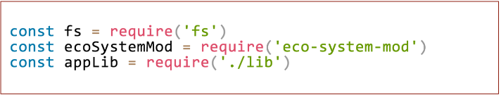
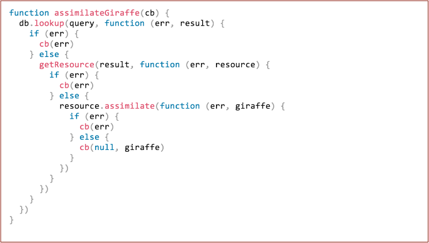
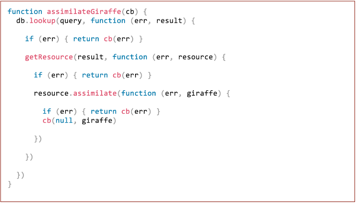
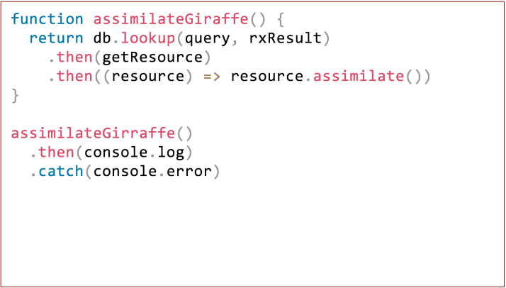
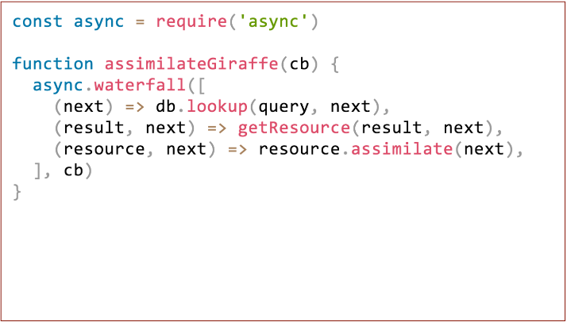
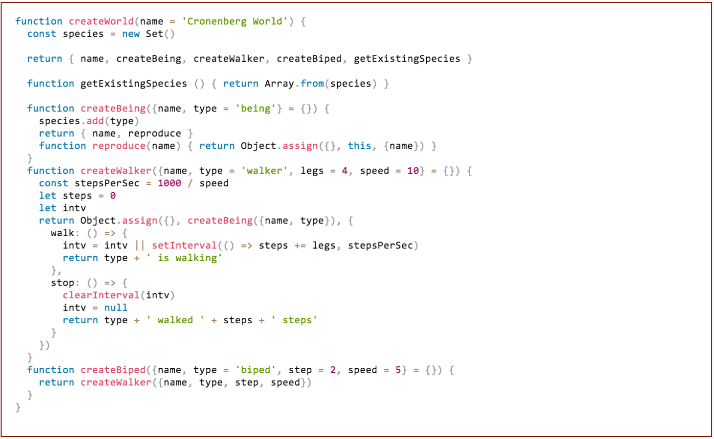

<!--
master: title-page
-->

# Patterns
## Node Training
### 1 Session

---

<!--
master: standard-slides
-->

# Patterns
- Node Conventions
- Ecosystem Conventions
- Recommend Conventions (a.k.a Opinion)

---

<!--
master: standard-slides
-->

# The Module Pattern

- Node's module system is based on CommonJS
- Modules are _synchronously_ required at initialisation time
- A module is a file that's run in a function scope context (not globally)
- It has a local `require` function for loading module dependencies

---

<!--
master: standard-slides
-->

# The Module Pattern

- Most modules shouldn't be singletons
    - When a module needs to be initialized export a function (the 3rd approach)
- Some modules could be singletons
    - Utility belts, config, collections of constants...
    - In this case export an object (2nd approach)

---

<!--
master: browserify-slides
-->

# Browserify

- The export-require pattern can be transported to the browser via the browserify tool
- It works by bundling all the modules into a single file
    - This means require is still synchronous
    - Removes multiple HTTP request overhead
    - Can cause wastage on sites with lots of views
        - There are ways to externalize and share sub-bundles
- Browserify can also bundle core modules

---

<!--
master: es6-slides
-->

# ES6 Modules
```javascript
import fs from 'fs'
import * from './lib'
import {createServer} from 'http'
```
```javascript
export subMeth = () => 'wow.'
export default function initMod() { }
```
- EcmaScript 6 (ES 2015) defined a module syntax, primarily with the browser in mind
- Advantages of ES6 modules is statis dependency analysis
    - Leads to cool ideas like tree shaking in __Rollup.js__
- Not currently supported in Node (without a build step)
    - __Work is under way__, but there are significant interoperability challenges

---

<!--
master: standard-slides
-->

# Concurrency
```javascript
setTimeout(function () {
    console.log('get shwifty')
), 1000)
```
- JS functions being first-class citizens allows for Continuation Passing Style logic
    - In other words, call a function when a operation is complete
        - This is a callback

---

<!--
master: concurrency2-slides
-->

# Concurrency
```javascript
const fs = require('fs')
function getInode(path, cb) {
    fs.stat(path, (err, stats) => {
        if (err) { return cb(err) }
        cb(null, stats.ino, path)
    })
}
getInode(process.cwd(), (err, inode, path) => {
    if (err) {
        console.error("Couldn't do it chum", inode)
        return
    }
    console.log('inode for %s is %d', path, inode)
})
```
- In Node, the callback convention _strictly_ __error first__... then values
- A function that accepts a callback generally takes the callback last

---

<!--
master: image
-->

# Concurrency
## The so-called pyramid of doom


---

<!--
master: standard-slides
-->

# Concurrency
- The pyramid of doom problem has ben exaggerated in the past
- Any type of excessive nesting causing undue cognitive load
    - Any type of excessive nesting can be solved (or at least mitigated) with 
    planning internal architecture and adopting good habits

---

<!--
master: image
-->

# Concurrency
## avoid else branches by returning early


---

<!--
master: image
-->

# Concurrency
## break out inlined functions


---

<!--
master: standard-slides
-->

# Concurrency
- Additional benefits of converting inline function expressions to function statements:
    - Forces the function to be named, much better from a debugging perspective
    - Encourages highly structured code, in small functions
    - Small functions are beneficial from a code practices and a performance perspective
    - The extra structure makes it easy to refactor
    - Refactoring ease makes future optimizations easier

---

<!--
master: image
-->

# Concurrency
## switching to promises is an option


---

<!--
master: standard-slides
-->

# Concurrency
- Promises do add structure and make for tidier code
    - At least from an API consumer perspective
- However using a runtime abstraction for structure will always come at cost

---

<!--
master: standard-slides
-->

# Concurrency
- Promises add CPU and memory overhead
- Promises are comparitively slow compared to callbacks
    - However execution time of an async abstraction is rarely bottleneck
- Promises tend to be all-in opt-in abstraction
    - APP's consumed need to be promises (or converted)
- There is a learning curve investment
- Deep nesting in promise callbacks is observed in the wild

---

<!--
master: image
-->

# Concurrency
## the async module can reduce nesting too


---

<!--
master: standard-slides
-->

# Concurrency
- Similar trade-offs to promises
    - Overhead
    - Master pattern
    - Learning curve
    - Entirely possible to deep nest
- Like promises errors are propagated by design
- Like promises, async is a project flow-control choice

---

<!--
master: standard-slides
-->

# Error handling
- Asynchronous error handling patterns have already been demonstrated
    - Error first callbacks
    - Manually propagate errors up through parent callbacks
- `async` - handled error propagation
- Promises built-in error catching (including sync errors) and propagation

---

<!--
master: standard-slides
-->

# Error handling
- Error categories
    - Developer errors
        - human error
        - should always crash the process immediately and noisily
    - Operation errors
        - system failure
        - failures resulting from bad user input
        - should be caught and handled if possible

---

<!--
master: standard-slides
-->

# Error handling
- Went to `throw`
    - Developer error
    - Unresolvable Operational errors that lead to a fatal status
- When to `try/catch`   
    - When an API throws outside of the above scenarios
    - Other possible edge scenarios, like syntax detection

---

<!--
master: standard-slides
-->

# Error handling
- Went to never throw
    - If there's any chance that the error could be operational
        - e.g. parsing or serializing based on user input
- When to never `try/catch`
    - Never try to catch an error that could occur asynchronously, it won't be caught

---

<!--
master: standard-slides
-->

# Error handling
- try/catch causes significant deoptimizations
    - always isolate a try/catch in its own function
- Alternatives to the throw - try - catch pattern
    - Return an Error object and check return value
    - Return an object with a `value` and `error` properties

---

<!--
master: standard-slides
-->

# Code Reuse
- Avoid inheritance as a master pattern
- Problems with class inheritance
    - creates parent/child object taxonomies as a side-effect
    - the fragile base class problem
    - tight coupling
    - inflexible hierarchy
    - duplication by necessity
    - gorilla-banaca problem

---

<!--
master: standard-slides
-->

# Code Reuse
- Especially avoid deeply nested structures
    - Deep hierarchies create maintenance nightmares
    - Deep hierarchies create debugging issues
    - Deep hierarchies create performance issues, both intrinsically and as an emergent property

---

<!--
master: standard-slides
-->

# Code Reuse
- Class Inheritance in JavaScript is an emulation - It's prototype inheritance with class semantics
    - This leads to fundamental misunderstandings
    - And a variety of nefarious fail-modes at the mesh points
        - e.g. like what happens when forgetting `new`

---

<!--
master: standard-slides
-->

# Code Reuse
- Prefer a functional approach
- Prefer to store state with closure scope
- Prefer composition

---

<!--
master: image
-->

# Code Reuse


---

<!--
master: standard-slides
-->

# Code Reuse
- Avoid ES6 classes
    - because they encourage class inheritance
    - and it's still just prototype inheritance
- Use constructors internally
    - in property access hot paths
    - when a large amount (1000's) of instances will be created
    - as a conscious decision to help identify memory leaks whilst profiling
    - keep structures flat however

---

<!--
master: image
-->

# Code Reuse


---

<!--
master: es5-slides
-->

# ES5
- From Node v0.10 to v6 ES5 is supported - use it
- The `Array map, reduce, forEach`, etc. methods support the FP paradigm, use them
    - If you find you need speed, go straight to procedural loops
    - Lodash is only suitable if the plan is to use advancd functional methods, and 
    the entire team understands this advanced approach
- `use strict` is generally good practice, and helps to prevent certain bugs
- `Object.create, Object.defineProperty, ObjectDefineProperties` whilst verbose can be useful in certain
situations - avoid creativity with getters and setters
- `Object.freeze` et. al. and `bind` are just too expensive

---

<!--
master: standard-slides
-->

# ES6
- If project constraints allow, it's perfectly okay to use modern features if they support a functional approach
- Transpilation was an intermediate inconvenience, it's better to move away from build steps if we can
    - And avoid transpiling to older versions, behaviours can differ

---

<!--
master: standard-slides
-->

# ES6
- use `const` for module assignments (you don't want those bindings overwritten!)
- use `const` unless there's an explicit need to reassign
    - `const` optimizes
    - `const` can stop reassignment programmer errors

---

<!--
master: es62-slides
-->

# ES6
```javascript
const VERSION = 1
const NAME = 'Tiny Rick'
const usage  = '
    -----------------------------------------

    Welcome to ${NAME} version ${VERSION}

    -----------------------------------------
```
- template strings are awesome
    - multiline
    - easy to use other quote marks
    - interpolation is cleaner - also allows expressions
    - tag functions are weird...

---

<!--
master: es63-slides
-->

# ES6
- parameter defaults are awesome:
```
name = 'bob', say = 'nothing') =>
    name + ' says' + say`
```
- destructing is awesome:
```
({like, a, contract}) => {}
```
- rest operator is awesome:
```
(args...) => console.log(args)
```
- spread operator is awesome:
```
concatAllParams(...['no', 'more', 'array', 'apply'])
```
- computed properties are awesome:
```
let foo = 'bar'
let o = {[foo]: 'foo'}
```
- shorthand properties are awesome:
```
(wubba, lubba, dub) => ({wubba, lubba, dub})
```

---

<!--
master: standard-slides
-->

# ES6
- fat arrow functions ( __() => {}__ ) help to reduce noise but can make debugging harder
    - it's a trade off
    - generally use these for small pieces of code
- avoid ES6 classes
- jury is still out in ES6 modules
- `Map` and `Set` can be more performant
- WeakMap and WeakSet allow objects to be keys
- Generators are expensive

---

<!--
master: standard-slides
-->

# Where Next?
- Related NodeCrunch articles
    - [http://www.nearform.com/nodecrunch/10-tips-coding-node-js-4-reproduce-core-callback-signatures](http://www.nearform.com/nodecrunch/10-tips-coding-node-js-4-reproduce-core-callback-signatures)
    - [http://www.nearform.com/nodecrunch/10-tips-coding-node-js-3-know-throw-2](http://www.nearform.com/nodecrunch/10-tips-coding-node-js-3-know-throw-2)
- FP vs Class inheritance posts by Eric Elliot
    - [https://medium.com/javascript-scene/the-two-pillars-of-javascript-ee6f3281e7f3](https://medium.com/javascript-scene/the-two-pillars-of-javascript-ee6f3281e7f3)
    - [https://medium.com/javascript-scene/the-two-pillars-of-javascript-pt-2-functional-programming-a63aa53a41a4#.6pkk0bsgs](https://medium.com/javascript-scene/the-two-pillars-of-javascript-pt-2-functional-programming-a63aa53a41a4#.6pkk0bsgs)